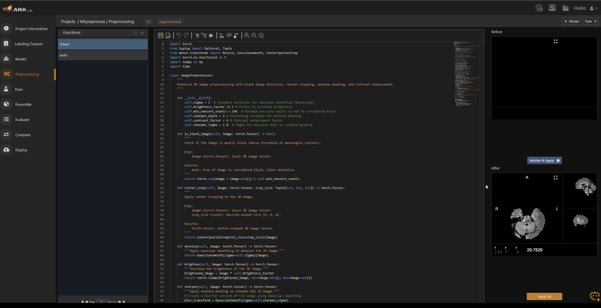

# MSRENet: MS Lesion Segmentation in Neuroinformatics

This repository contains the code and resources associated with the paper "MSRENet: A Generalized Residual Encoder nnUNet for Robust Multiple Sclerosis Lesion Segmentation Across Diverse MRI Datasets" submitted to Neuroinformatics. Our work focuses on developing a robust and generalizable deep learning framework for automated MS lesion segmentation, leveraging the nnU-Net architecture with residual connections.

## Collaboration with PaxeraHealth and ARK3 Platform

This project is a collaborative effort with PaxeraHealth, aiming to bridge the gap between cutting-edge academic research and real-world clinical applications. Our goal is to provide a ready-to-use model that can be seamlessly integrated into clinical workflows. The developed MSRENet model is specifically designed to be deployed and utilized within the ARK3.2 platform, PaxeraHealth's AI-powered medical imaging platform. This integration allows for direct implementation and clinical utility, making advanced MS lesion segmentation accessible to healthcare professionals.

## Data
The datasets used are publicly available:
-   **MSSEG2016:** [https://portal.fli-iam.irisa.fr/msseg-challenge/](https://portal.fli-iam.irisa.fr/msseg-challenge/ )
-   **ISBI2015:** [https://smart-stats-tools.org/](https://smart-stats-tools.org/ )

## Preprocessing Pipeline

The preprocessing pipeline is a crucial component of our methodology, ensuring consistency and optimal input for the MSRENet model. The `src/preprocess.py` script contains the MONAI-based implementation of this pipeline. The steps involved are detailed in the table below, mirroring the comprehensive preprocessing pipeline described in our paper:

| Stage | Step | Purpose | Method/Tool | Key Parameters |
|---|---|---|---|---|
| Manual/Pre-applied | Denoising | Reduces noise while preserving lesion visibility | 3D Non-Local Means | 3x3x3 voxel patch |
| Manual/Pre-applied | Rigid Registration | Aligns all sequences to FLAIR reference | Rigid transformation | Sinc interpolation |
| Manual/Pre-applied | Skull Stripping | Removes non-brain tissues | volBrain platform | T1w-based brain mask |
| Manual/Pre-applied | Bias Field Correction | Corrects intensity inhomogeneities | N4 algorithm | - |

### Using the Preprocessing Script in ARK

To utilize the `preprocess.py` script within the ARK platform, follow these steps:
1.  **Create a Project in ARK**: Follow the instructions in the following video to create a new project in ARK: [https://www.youtube.com/watch?v=EvmUMBrUVJE](https://www.youtube.com/watch?v=EvmUMBrUVJE)
2.  **Download the datasets**: Import the data in ARK Manaager.
3.  **Copy the Preprocessing Script**: Navigate to the 'Preprocessing' tab within your ARK project and copy the content of `src/preprocess.py` into the designated code editor.

### Python Version and Library Requirements

The preprocessing script is developed with Python 3.10+. A significant advantage of using the ARK platform is that all necessary libraries, including MONAI, are pre-installed within the ARK environment. Therefore, there is **no need to install any additional libraries** when running this script within ARK.

## Model and Evaluation

Our trained MSRENet model weights can be uploaded to ARK for direct use. ARK supports model weights in the `.px` extension, allowing for seamless import of our specialized model. Furthermore, ARK now supports our model as a specialized, pre-integrated solution, enabling direct implementation without complex setup. The video linked above also illustrates the process for model upload, training, and evaluation within the ARK platform.

## Specifications and Resources

Detailed specifications of the MSRENet architecture, training methodology, and evaluation metrics are provided in the accompanying paper. The datasets used for training and validation are publicly available, and their access details are described in the paper's methodology section. 

## ARK Platform Usage Screenshots

Below is a screenshot illustrating the ARK platform interface, specifically showing the 'Preprocessing' tab where the `preprocess.py` script can be integrated.

Further screenshots illustrating other aspects of ARK usage, such as project creation, model upload, training, and evaluation, can be found in the video tutorial linked above and will be added here as they become available or are generated.
